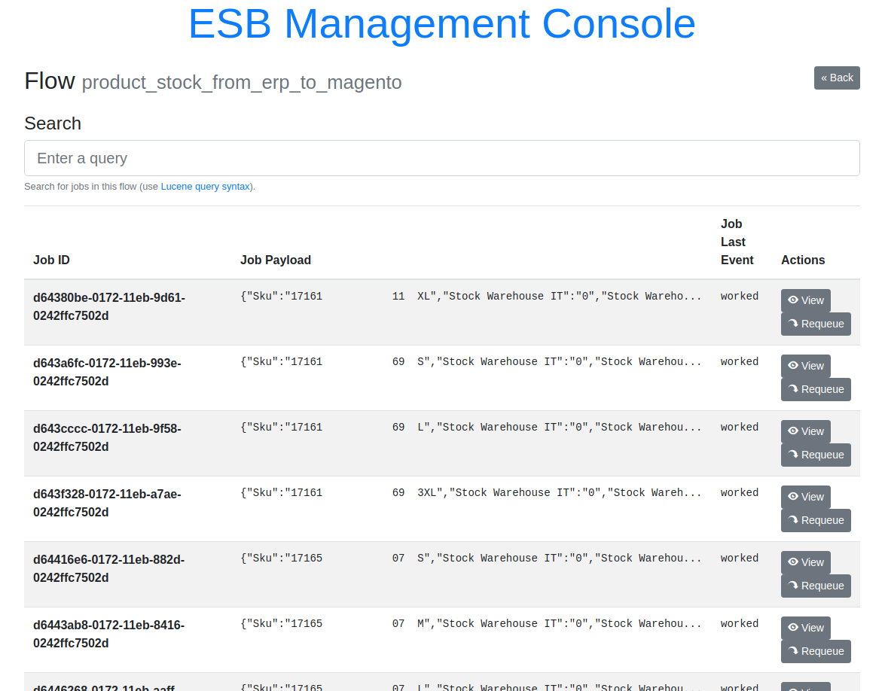
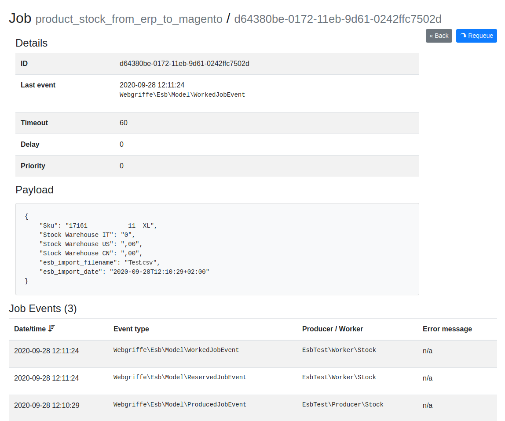

Webgriffe ESB
=============

Simple, beanstalkd powered, ESB framework.

[](https://travis-ci.org/webgriffe/esb)

Introduction
------------

Webgriffe ESB is a PHP framework that aims to speed up the development of [Enterprise Service Buses](https://en.wikipedia.org/wiki/Enterprise_service_bus).

It uses [Beanstalkd](http://kr.github.io/beanstalkd/) as a queue engine and [Elasticsearch](https://www.elastic.co/elasticsearch/) as jobs persistence layer. 
It's built on top of popular open-sourced PHP libraries like:

* [Amp](http://amphp.org/)
* [Symfony's Dependency Injection](http://symfony.com/doc/current/components/dependency_injection.html)
* [Monolog](https://github.com/Seldaek/monolog)

Architecture & Core concepts
----------------------------

Integrating different systems together is a matter of data flows. With Webgriffe ESB every data flow goes one way, from a system to another through a Beanstalkd **tube**. Every tube must have a **producer** which creates **jobs** and a **worker** that processes them. So data goes from the producer to the worker through the tube.

With Webgriffe ESB you integrate different systems by only implementing producers and workers. The framework takes care of the rest.

Webgriffe ESB is designed to use a single binary which is used as the main entry point of the whole application; all the producers and workers are started and executed by that single PHP binary. This is possible thanks to the [Amp](http://amphp.org/) concurrency framework.

Requirements
------------
* PHP 7.4, 8.0, 8.1, 8.2, 8.3
* Beanstalk
* Elasticsearch 7.*

Installation
------------
Require this package using [Composer](https://getcomposer.org/):

```bash
composer require webgriffe/esb
```

Configuration
-------------
Copy the sample configuration file into your ESB root directory:

```bash
cp vendor/webgriffe/esb/esb.yml.sample ./esb.yml
```

The `esb.yml` file is the main configuration of your ESB application, where you have to define flows with their worker and producer services.

```yaml
services:
  _defaults:
    autowire: true                      # This is optional (see https://symfony.com/doc/current/service_container/autowiring.html)

  My\Esb\Producer:                      # A producer service definition
    arguments: []

  My\Esb\Worker:                        # A worker service definition
    arguments: []


flows:
  sample_flow:                          # The flow "code" and will be the Beanstalkd tube name
    description: Sample Flow            # The flow description
    producer:
      service: My\Esb\Producer          # A producer service ID defined above
      batch_size: 1200                  # Jobs are produced in batches of 1200 jobs. Optional: default is 1000
    worker:
      service: My\Esb\Worker            # A worker service ID defined above
      instances: 1                      # The number of worker instances to spawn for this flow
      error_retry_delay: 0              # The number of seconds to wait before an errored job can be retried. The default is 0 (errored jobs can be retried immediately). Useful when "retrying later" might solve the problem.
      release_delay: 0                  # (deprecated) older name of the error_retry_delay parameter
      max_retry: 5                      # The number of maximum work retries for a job in this tube/flow before being buried
    dependencies:                       # This whole section can be omitted if the current flow has no dependencies
      flows: ['other_flow_1', 'other_flow_2']  # Optional: dependencies of this flow toward other flow(s)
      delay_after_idle_time: 1000       # Optional: delay that a worker with dependencies waits before working the first job received after the tube was empty
      initial_polling_interval: 1000    # Optional: initial polling delay that a worker waits when it has to wait for a dependency that is not idle
      maximum_polling_interval: 60000   # Optional: maximum polling delay that a worker waits when it has to wait for a dependency that is not idle
      polling_interval_multiplier: 2    # Optional: polling delay increase factor whenever a worker is waiting for a dependency that is not idle
    es_index_settings:                  # Optional: the update ElasticSearch index API settings (see https://www.elastic.co/guide/en/elasticsearch/reference/current/indices-update-settings.html#update-index-settings-api-request-body). This is useful if you want to control index settings.
      index:                            # For example you can set the total_fields limit to an higher (or lower) value
        mapping:
          total_fields:
            limit: 2000
    es_index_mapping:                   # Optional: the update ElasticSearch index API mapping (see https://www.elastic.co/guide/en/elasticsearch/reference/current/indices-put-mapping.html#put-mapping-api-request-body). This is useful if you want to control index mapping.
      properties:
        title:
          type: text
    es_index_aliases:                   # Optional: the update ElasticSearch index API aliases (see https://www.elastic.co/guide/en/elasticsearch/reference/current/indices-add-alias.html#add-alias-api-request-body). This is useful if you want to control index aliases.
      my_alias:
        is_hidden: true

  other_flow_1:
    # ...
    
  other_flow_2:
    # ...
```
The `services` section is where you have to define your worker and producer services using the syntax of the [Symfony Dependency Injection](http://symfony.com/doc/current/components/dependency_injection.html) component.
In the `services` section you also find two services Webgriffe\Esb\Producer\CleanOldJobs and Webgriffe\Esb\Worker\CleanOldJobs that you should keep if you want to enable the flow that periodically deletes old jobs.

The `flows` section is where you have to define your ESB flows. Every flow must refer to a producer and a worker service defined in the `services` section.
In the `flows` section you also find the definition of the `clean_old_jobs_flow`: you should keep it if you want old jobs to be periodically deleted.
This is also the section where dependencies between flows are defined. See the **Dependencies** section for details.

You also have to define some parameters under the `parameters` section. Please refer to the `esb.yml.sample` file for more informations about required parameters. Usually it's better to isolate parameters in a `parameters.yml` file which can be included in the `esb.yml` as follows:

```yaml
# esb.yml
imports:
  - { resource: parameters.yml}

services:
  # ...

flows:
  # ...
```

```yaml
# parameters.yml
parameters:
  beanstalkd: tcp://127.0.0.1:11300
  # Other parameters here ...
```

Please refer to the [sample configuration file](https://github.com/webgriffe/esb/blob/master/esb.yml.sample) for the complete list of parameters and for more information about the configuration of your ESB.

Dependencies
------------

It is possible to specify **dependencies** across flows, which ensure that a flow cannot process any job as long as one or more configured flows are working their jobs. This is done by using the `dependencies` configuration section: if you want flow A to depend on flow B, you specify the `dependencies` section in flow A's configuration to list flow B:

```yaml
# esb.yml
# ...

flows:
  flow_B:
    #...

  flow_A:
    #...
    dependencies: 
      flows: ['flow_B']
```

When one such dependency is specified so that flow A depends on flow B, whenever flow B is working some job and/or it has queued jobs, then flow A will still produce and queue new jobs, but **it will not work them**. When flow B finishes processing its last job and its Beanstalk tube is empty, then flow A begins to work through its jobs.
If a new job is created for flow B while flow A is working, flow A will complete the job (or jobs, if there are multiple workers) that was already being worked and **then it will stop until all its dependencies are idle** (empty tube and no jobs being worked).
Dependencies can also be multiple, meaning that flow A can depend on both flow B and flow C (and more, if needed). In this case flow A will wait until **all** its dependencies are idle. To declare multiple dependencies, simply list all dependencies in the `dependencies.flows` field.
Indirect dependencies are **not** honored. This means that if flow A depends on flow B, which in turn depends on flow C, a job for flow C will block flow B, but it will **not** stop flow A. Flow A will only check flow B. If you want flow A to also check flow C, simply make the dependency between flow A and flow C explicit by saying that flow A depends on both flows B and C.

When a flow depends on another, such as flow A depending on flow B, whenever flow A's worker extracts a job from its queue it will check its dependencies to ensure that they are all idle. If one is found that is not idle, flow A will begin polling that dependency to see when it finishes.
If desired, the timing of this polling action can be controlled with a few configuration parameters (these are all optional):
* `initial_polling_interval` (default 1000ms) is the number of milliseconds that flow A will wait the *first* time, before rechecking flow B's status.
* `polling_interval_multiplier` (default: 2) after the first delay defined by `initial_polling_interval`, each subsequent delay is obtained by multiplying the previous one by this parameter. The default value of 2 means that each time the delay doubles, so if the first delay is 1000ms, the second will be 2000ms, then 4000ms etc. Setting this value to 1 forces the system to keep on using the initial delay value without change.
* `maximum_polling_interval` (default: 60000ms) the exponential increase imposed by `polling_interval_multiplier` is limited by this value, which is the maximum possible polling interval.
* `delay_after_idle_time` (default: 1000ms) sometimes it may happen that flow A's and flow B's producers *begin* producing new jobs at the same time. If flow A was idle and its producer manages to produce the first job before flow B's, flow A's worker may begin to work the new job before flow B's producer has had time to produce its job, and so the dependency would be violated. To solve this, whenever a flow with some dependencies has been waiting for some time for new jobs to arrive (flow A in our example), upon receiving a new job it will wait a time specified by `delay_after_idle_time` before resuming operation. This gives flow B's producer enough time to publish its job in its tube, which will ensure that flow A will wait for its dependency when the timeout expires. This parameter should not need changing unless one is dealing with a very slow producer, in which case it may be appropriate to increase it.

Notice that the exponential polling time increase is reset for each dependency: if a flow depends on multiple other flows, each time a dependency goes idle the timing parameters are reset before checking the next dependency.

Producers
---------

A producer can be any service whose class implements the `ProducerInterface`. However, implementing only the `ProducerInterface` is not enough: every producer must implement also one of the supported *producer type* interfaces. This is because the framework must know when to invoke every producer. At the moment these are the supported producer types:

* `RepeatProducerInterface`: these producers are invoked repeatedly every fixed interval.
* `CrontabProducerInterface`: these producers are invoked when their [crontab expression](https://en.wikipedia.org/wiki/Cron#CRON_expression) matches.
* `HttpRequestProducerInterface`: these producers are invoked when the ESB's HTTP server receives a corresponding HTTP request.

Refer to these interfaces in the source code for more information.
The `produce` method of the `ProducerInterface` must return an Amp's [Iterator](https://amphp.org/amp/iterators/), this allows you to produce a collection of jobs with a single `produce` invocation. Moreover iterators allows to have long running produce operations which are executed asyncronously.

Also, keep in mind that **you should never use I/O blocking function calls inside your producers**. Use [Amp](https://amphp.org/) or [ReactPHP](https://reactphp.org) libraries when you need to do I/O operations.

See the dummy producers in the [tests/](https://github.com/webgriffe/esb/tree/master/tests) directory for some examples.

Workers
-------

A worker can be any service whose class implements the `WorkerInterface`. Every worker is invoked immediately when a job is available on its flow's tube.

The `work` method of a worker must return an Amp's [Promise](https://amphp.org/amp/promises/) that must resolve when the job is worked succesfully. Otherwise the `work` method must throw an exception.

When a worker successfully works a job, the ESB framwork deletes it from the tube. Conversely, when a worker fails to work a job the ESB framework keeps it in the tube for a maximum of a `max_retry` times. If an `error_retry_delay` other than 0 is specified, then the job will not be retried for at least the specified number of seconds. If the maximum number of retries is exceeded, the job is **buried** and a critical event is logged.

Like for producers, **you should never use I/O blocking function calls inside your workers**. Use [Amp](https://amphp.org/) or [ReactPHP](https://reactphp.org) libraries if you need to do I/O operations.

See the dummy workers in the [tests/](https://github.com/webgriffe/esb/tree/master/tests) directory for some examples.

Initialization
--------------

`WorkerInterface` and `ProducerInterface` both support an `init` method which is called by the ESB framework at the boot phase.

The `init` method must return an Amp's [Promise](https://amphp.org/amp/promises/). This allows you to perform initialization operations asyncronously (for example instantiating a SOAP client with a remote WSDL URL).

Unit testing
------------

You can (and should) also unit test your workers and producers. Because workers and producers must return promises and iterators you have to use the Amp loop inside your tests. You should also use the [amphp/phpunit-util](https://github.com/amphp/phpunit-util) to reset the loop state between tests.

Unit test example
-----------------

Here follows an example of a producer test which verifies that the producer produces stock inventory update jobs based on an XML file in a given directory.

```php
public function testShouldProduceMultipleJobsWithMultipleEntriesFile()
{
    filesystem(new BlockingDriver());
    vfsStream::setup();
    $this->importFile = vfsStream::url('root/stock.xml');
    $this->producer = new Stock($this->importFile);
    copy(__DIR__ . '/StockTestFixtures/multiple_entries.xml', $this->importFile);

    $this->jobs = [];
    Loop::run(
        function () use ($data) {
            $iterator = $this->producer->produce($data);
            while (yield $iterator->advance()) {
                $this->jobs[] = $iterator->getCurrent();
            }
        }
    );

    $this->assertCount(52, $this->jobs);
    $this->assertEquals(new Job(['sku' => 'SKU-1', 'qty' => 9519.000]), $this->jobs[0]);
    $this->assertEquals(new Job(['sku' => 'SKU-23', 'qty' => 299.000]), $this->jobs[12]);
    $this->assertEquals(new Job(['sku' => 'SKU-50', 'qty' => 2017.000]), $this->jobs[21]);
}

```

Here follows the example of a unit test for the related worker which takes the SKU and quantity to update from the job and then performs an API call to update the quantity.

```php
public function testWorksSimpleJob()
{
    $this->sessionId = random_int(1, 1000);
    $this->client = $this->prophesize(Client::class);
    $this->clientFactory = $this->prophesize(Factory::class);
    $this->clientFactory->create()->willReturn(new Success($this->client->reveal()));
    $this->worker = new Stock($this->clientFactory->reveal());

    $sku = 'SKU-1';
    $qty = 10;
    $this->client
        ->login()
        ->shouldBeCalled()
        ->willReturn(new Success($this->sessionId))
    ;
    $this->client
        ->call('cataloginventory_stock_item.update', [$sku, ['qty' => $qty, 'is_in_stock' => true]])
        ->shouldBeCalled()
        ->willReturn(new Success(true))
    ;
    $this->client->endSession()->shouldBeCalled()->willReturn(new Success());

    $job = new QueuedJob(1, ['sku' => $sku, 'qty' => $qty]);
    Loop::run(function () use ($job) {
        yield $this->worker->init();
        yield $this->worker->work($job);
    });
}
```

Web Console
-----------

A web console UI is available and allows to inspect tubes and jobs; is it also possible to search jobs and requeue them. The web console is currentyl only available under HTTP (not HTTPS) and must be configured using the following parameters:

```yaml
# esb.yml
parameters:
  # ...
  console_port: 8080                      # Web console port
  console_username: admin                 # Web console username
  console_password: password              # Web console password
  console_log_file: /tmp/esb_console.log  # Web console server log file

# ...
```

For example, given the configuration above, you can access to the web console at the URL `http://<ip_or_hostname>:8080/` using `admin` as username and `password` as password.

The web console HTTP server must be set on a different port then the one used by the `HttpRequestProducerInterface` producers (and identified by the `http_server_port` parameter).

In the web console dashboard you can check the status of the configured flows:


By clicking on a flow, you can see a searchable list of jobs for that flow. The list is paginated and it allows one to manually requeue jobs, if needed:



Clicking on a single job or on the *view* button, one can see further details of a specific job, as well as forcing it back in the queue:



Deployment
----------
As said all workers and producers are managed by a single PHP binary. This binary is located at `vendor/bin/esb`. To deploy and run your ESB application all you have to do is deploy your application as any other PHP application (for example using [Deployer](https://deployer.org/)) and make sure that `vendor/bin/esb` is always running (we suggest to use [Supervisord](http://supervisord.org/) for this purpose).

Keep in mind that the `vendor/bin/esb` binary logs its operations to `stdout` and it reports errors using `error_log()` function. With a standard PHP CLI configuration all the `error_log()` entries are then redirected to `stderr`. This is done through [Monolog](https://github.com/Seldaek/monolog)'s [StreamHandler](https://github.com/Seldaek/monolog/blob/master/src/Monolog/Handler/StreamHandler.php) and [ErrorHandler](https://github.com/Seldaek/monolog/blob/master/src/Monolog/Handler/ErrorLogHandler.php) handlers. Moreover all warning (or higher level) events are handled by the [NativeMailHander](https://github.com/Seldaek/monolog/blob/master/src/Monolog/Handler/NativeMailerHandler.php) (configured with `logger_mail_to` and `logger_mail_from` parameters).

You can also add your own handlers using the `esb.yml` configuration file.

Contributing
------------

To contribute simply fork this repository, do your changes and then propose a pull request.

We recommend to use Docker. Indeed a [`docker-compose.yml`](https://github.com/webgriffe/esb/blob/master/docker-compose.yml) file is provided.

Just copy the `.env.dist` file to `.env` and adjust the environment variables values according to your environment.

For example, to **run the entire test suite** (PHP Code Sniffer, PHPStan, PHPUnit, etc...) you can simply run:

```bash
docker-compose run php composer tests
```

Or to only run PHPUnit tests you can use:

```bash
docker-compose run php vendor/bin/phpunit
```

The test suite uses the `ESB_BEANSTALKD_URL` environment variable to get the connection URL of the Beanstalkd instance. This environment variable is already set in the provided [`docker-compose.yml`](https://github.com/webgriffe/esb/blob/master/docker-compose.yml) file.

You can also run an instance of the ESB locally using Docker. You must create an `esb.yml` configuration file in the root directory and then run:

```bash
docker-compose up
```

License
-------

This library is under the MIT license. See the complete license in the LICENSE file.

Credits
-------
Developed by [Webgriffe®](http://www.webgriffe.com/).
